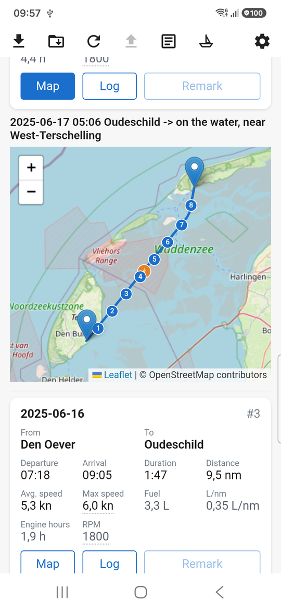
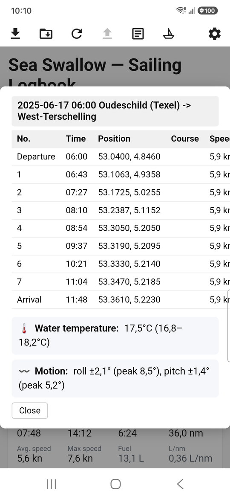
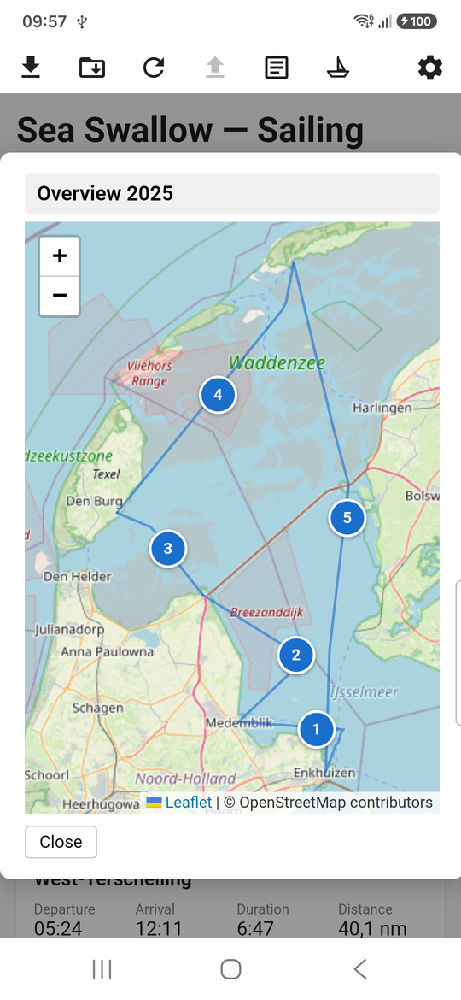
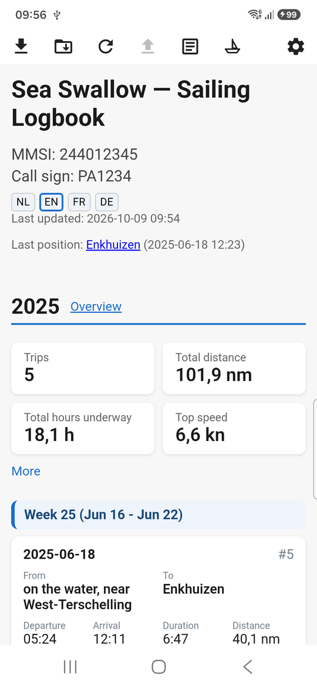
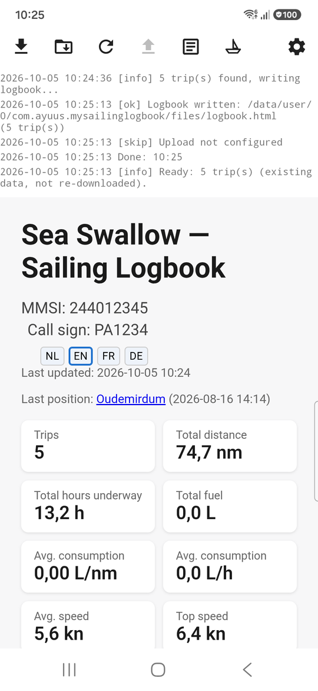
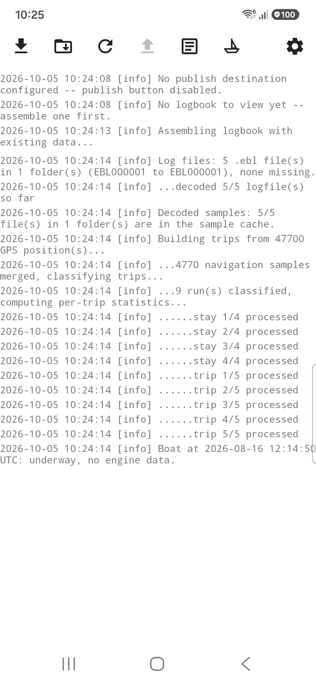
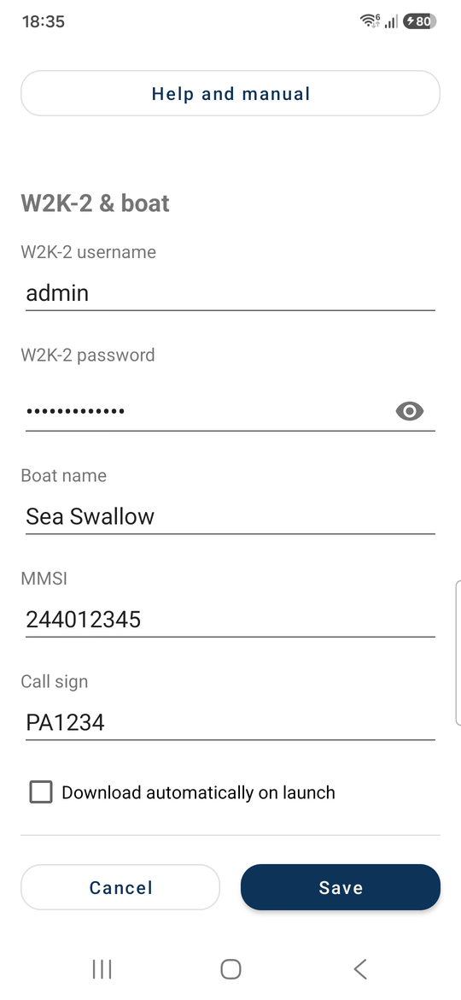
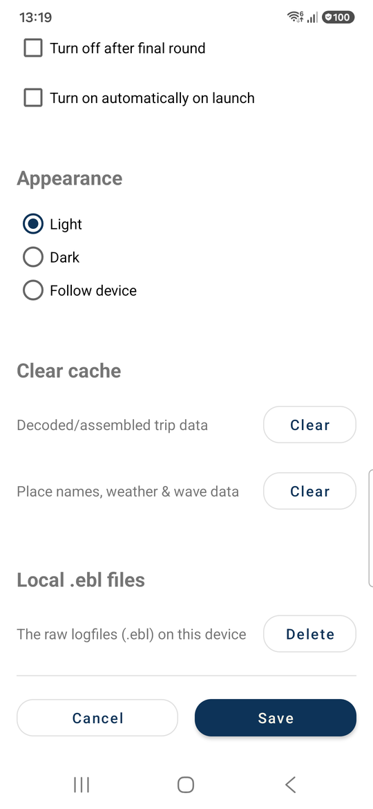
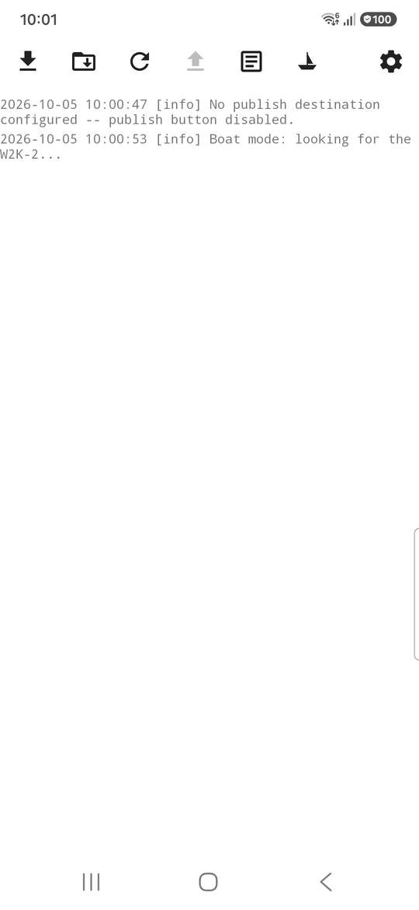
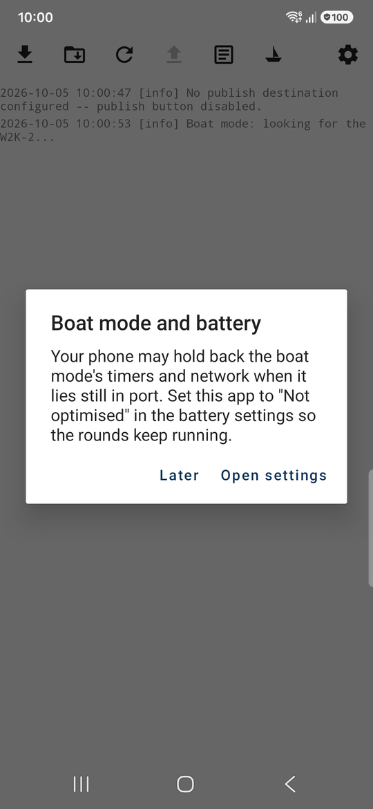

# My Sailing Logbook (Android)

Android app that downloads voyage data from a boat's [Actisense W2K-2](https://actisense.com) NMEA
2000-to-WiFi gateway, assembles the same HTML sailing logbook the desktop
[nmea2log](https://github.com/Ayuus/nmea2log) CLI produces, shows it in-app, and (optionally)
publishes it to a WordPress site. An optional "boat mode" can also do all of the
above on its own, on an interval, while the app stays closed -- see "Using the app" below.

It does **not** reimplement any of the NMEA 2000 decoding, trip-building, or HTML-generation
logic. It embeds the real `nmea2log` Python package from the `nmea2log` repo directly
(via [Chaquopy](https://chaquo.com/chaquopy/)) and drives it from Kotlin. A fix or feature added to
`nmea2log`'s Python code is picked up by this app automatically on the next build -- there is no
copy to keep in sync.

**Looking for testers**: so far this has only been run against one boat's NMEA2000 network (a
**motorboat**, one Actisense W2K-2) and two physical Android devices. Other boats/instrument mixes
and other Android versions/devices will likely surface issues this setup never hits. Sailboat
support in particular is on the wishlist but untested so far -- see the same note in the
[nmea2log README](https://github.com/Ayuus/nmea2log#readme) for why. Feedback is very welcome via
[GitHub issues](https://github.com/Ayuus/mysailinglogbook-android/issues).

## Screenshots

Taken on a phone in English, with the fictional trips of the demo logbook (a made-up boat, "Sea Swallow", not a real
one -- generated with `examples/generate_demo_logbook.py` in the [nmea2log](https://github.com/Ayuus/nmea2log) repo).

<p>



</p>

*The maps in the logbook (OpenStreetMap): the **Map** button of a trip shows its route -- its **Log** button the positions, course and speed along the way, with the water temperature and the boat's motion -- the **Overview** link of a year puts all trips of that year on one map.*

<p>



</p>

*The logbook (what the app shows when it is opened) -- after an assemble, the logbook with the log as a strip above it
(scroll it, or tap the log button for the whole log) -- the start of the log of such a run: the .ebl files found, the
trips assembled from them.*

<p>


</p>

*Settings (top and bottom).*

Under Appearance you choose light, dark or following the device, and the layout of the logbook: a card per trip (what
"automatic" picks on a phone held upright) or the table (what it picks on a wide screen).

<p>


</p>

*Boat mode on: the sailboat button is filled and the log reports what it is doing -- the one-time question about battery
optimisation when the mode is started.*

## Installation

**Play Store** (preferred): *pending review, link coming soon.* No install warnings, and updates
automatically.

**Or, the APK directly**: grab it from the
[latest release](https://github.com/Ayuus/mysailinglogbook-android/releases/latest) instead. This is
signed but not distributed via the Play Store, so Android will warn you before installing it --
expected for any app installed outside a store.

1. Download `app-release.apk` from the release page (under "Assets").
2. Open the downloaded file. Android will ask for permission to install apps from this source
   (browser/file manager) the first time -- allow it.
3. Tap Install.

Requires Android 7.0 (API 24) or newer.

## Using the app

### First-time setup

Open Settings (the gear icon, top right of the toolbar) and fill in:

- **W2K-2 username/password** -- the same login the W2K-2's own web interface uses.
- **Boat name, MMSI, call sign** -- shown in the logbook's header, not sent anywhere by
  themselves.
- **Publishing** (optional) -- a WordPress Application Password (for an account in the `logboek_editor`
  role) plus your site's address (`your-site.example` is enough: the app adds `https://` and the REST route
  `/wp-json/nmea2log/v1/logbook` itself; an address that already contains `/wp-json/` is used as typed), if you
  want the built logbook sent to your own website. Not the address of the logbook's own page: that gets redirected
  to a login page instead of uploading anything (the app reports that as an error). See the `nmea2log` README's own
  "Per-trip remarks, login-gated, via WordPress" section for the WordPress side of this setup. Leave it blank, or pick
  "Don't publish", to keep everything on the phone -- picking "Don't publish" keeps the WordPress details you typed, so
  switching back finds them again.
- **Local `.ebl` files** (Settings, at the bottom) -- a **Delete** button that removes the raw `.ebl`
  logfiles from the phone to free its storage, after a confirmation that says how many files and how
  much space. The logbook already built stays; a new download fetches the files from the W2K-2 again,
  and no new logbook can be assembled without them. (The Python side, `nmea2log.ebl_storage`, is shared
  with the iOS app.)

The phone needs to share a private network with the W2K-2 -- normally that means the phone runs
its own hotspot and the W2K-2 joins it as a client (the setup the W2K-2's own app expects), but
any shared network works just as well, e.g. phone and W2K-2 both joined to the same marina/router
WiFi instead. Either way there's no other way to reach it: the app only scans whatever private
subnet the phone itself is currently on, never the internet. Boat mode's own auto-start (below)
is the one exception -- it specifically needs the phone's own hotspot switched on, since that's
the signal it uses to tell "I'm on the boat" from any other network the phone might be on.

### The toolbar

Left to right: **download** (fetch new data from the W2K-2 and assemble the logbook), **import**
(copy `.ebl` files from an SD card or USB drive instead -- no W2K-2 needed, e.g. a card pulled
straight from the instrument -- then assemble/publish exactly like a normal download would), **assemble**
(assemble the logbook again from whatever's already on the phone, no W2K-2 needed -- useful to pick
up a settings change, or just to see the logbook without being near the boat), **publish** (send
the logbook to the website configured in Settings; it is sent as it is when it is up to date, and assembled
first when a .ebl file is newer than it or a setting that ends up in it has changed), **view logbook** (show the
already-built logbook full-screen, toggles back to the log), **boat mode** (see below), and
**settings**.

A long-running action (download/assemble/publish) shows a pulsing version of its own button --
tap it again to cancel. The notification shade shows the same thing while the app isn't on
screen, with a real progress bar.

### Boat mode

Turned on/off via the sailboat button (Settings has a checkbox "Turn on automatically on launch", which
starts it whenever the app opens with the boat's hotspot up). Once on, it keeps running in the background --
the app doesn't need to stay open -- and:

1. **Searches** for the W2K-2 every 5 minutes (`search_interval_minutes` in the Python
   `BootModeConfig` default -- not yet exposed as its own Settings field), without downloading
   anything yet.
2. Once found, runs a **round**: downloads new data and assembles the logbook, then waits for the
   configured interval ("A round (download + assemble) every ...") before the next one.
3. Recognises being **in harbour** (stationary + engine off, both for a configurable number of
   minutes) and **having left the boat** (the W2K-2 stops answering for a configurable number of
   minutes) as two different "the voyage is over for now" signals, each independently switchable
   to trigger a **final round** (and, if publishing is configured, an actual publish) --
   see the checkboxes under "Boat mode" in Settings.
4. Can optionally switch itself back off after that final round ("Turn off after final round"), or
   keep running and simply start searching again.

Android's own battery optimisation can hold back a background app's timers while the phone lies
still (e.g. moored in a marina) -- boat mode asks, once, to be exempted from that the first time
it's turned on. Declining is safe; rounds just become less reliably on-time if the phone has been
idle for a long while.

See [docs/boat-mode.md](docs/boat-mode.md) for the full technical writeup (states, timers,
notification behaviour) if you want more detail than this section gives.

### Why place names show up in the logbook

Every trip's departure/arrival, and the boat's last known position, are reverse-geocoded into a
real place name (e.g. "Écluse du barrage d'Arzal") rather than shown as bare GPS coordinates.
This uses OpenStreetMap's [Overpass API](https://overpass-api.de/) to find the nearest named
landmark, falling back to [Nominatim](https://nominatim.org/) for a plain address when nothing
suitable is nearby -- the same two-step lookup the desktop `nmea2log` CLI does, see the
[nmea2log README](https://github.com/Ayuus/nmea2log#readme) for the full explanation. Both need a
working internet connection on the phone at assemble/publish time (not from the W2K-2 -- that part
never needs internet at all); a lookup that keeps failing gives up for the rest of that run and
falls back to coordinates instead of retrying forever.

### Backing up your data

What is worth keeping is the **`.ebl` archive**: the logbook and the caches are rebuilt from it with one tap on
assemble. The settings are small -- keep your W2K-2 and WordPress logins in a password manager.

- **The archive** is the folder `Android/data/com.ayuus.mysailinglogbook/files/Actisense/` on the phone. Connect the
  phone to a PC with a USB cable (file transfer) and copy that folder to the PC, best into a folder that your cloud
  storage (OneDrive, Dropbox, Google Drive, ...) keeps in sync. Do it after every trip or season -- only the new
  `EBL000nnn` folders need copying -- and **before** you use Settings > Local .ebl files > Delete. On recent Android
  versions the phone's own file-manager apps often cannot open `Android/data`; a PC over USB can.
- **Restoring**: install the app, start it once, copy the folder back to the same place and tap assemble. The first
  assemble takes longer, as the caches are rebuilt too.
- **The built logbook** is also on your WordPress site when you publish.
- **Do not count on Android's automatic (Google) backup.** It is switched on for the app with Android's default rules,
  but it takes at most 25 MB per app -- the archive is far larger -- and the settings are encrypted with a key that stays
  in the phone, so they cannot be read on another phone.

## The log file

The app's log (every level, also the debug lines the log view does not show) is `nmea2log.log` in the app's
external files folder (`Android/data/com.ayuus.mysailinglogbook/files/`, next to the `Actisense` folder), so you can
read it from a PC over USB; 30 days of lines kept (pruned when a run starts), no size limit. What is in it, how it grows (a download or boat-mode round writes a debug line per file) and where
the iOS app keeps it: [nmea2log/docs/log-file.md](https://github.com/Ayuus/nmea2log/blob/main/docs/log-file.md).

(The sections below are for building this app from source instead -- not needed just to install
it.)

## Requirements

- **The [nmea2log](https://github.com/Ayuus/nmea2log) repo, checked out separately on the same
  machine.** This app's Gradle build points directly at that repo's `src/` directory (specifically
  the `nmea2log` package inside it) as a Chaquopy source set. It is not vendored or
  copied in here -- these two repos are only meant to be built together, side by side.
- Android Studio (or a standalone Gradle/JDK toolchain) with Android SDK **compileSdk/targetSdk
  37**, **minSdk 24**.
- A local Python **3.14** interpreter on the build machine. This is a Chaquopy build-time
  requirement only -- separate from the Python runtime Chaquopy bundles into the built APK -- and
  must match the version configured in `app/build.gradle.kts`'s `chaquopy { defaultConfig { version
  = "3.14" } }`.
- A real Actisense W2K-2 (or a network host that answers the same undocumented HTTP API -- see
  `w2k2_download.py` in the nmea2log repo) to actually test the download flow against. There is no
  simulator/mock for it.

## Building

1. Clone this repo and `nmea2log` next to each other, e.g.:
   ```
   Github/
     NMEA/                    <- nmea2log
     mysailinglogbook-android/   <- this repo
   ```
   (they don't have to be literal siblings -- any two paths work, see step 2 -- but that's the
   layout this project has been built and tested with).
2. Add the path to nmea2log's `src/` directory to this repo's `local.properties` (create the file
   if Android Studio hasn't already generated one with `sdk.dir` in it):
   ```properties
   nmea2log.src.dir=C\:\\Users\\you\\...\\NMEA\\src
   ```
   (Windows paths need doubled backslashes in a `.properties` file; a Linux/macOS path like
   `/home/you/.../NMEA/src` needs no escaping.) `local.properties` is git-ignored on both machines
   it's used on for a reason: this path is only ever correct on the one machine it names. The build
   fails with a clear error message if this property is missing.
3. Build and install:
   ```
   ./gradlew assembleDebug
   adb install -r app/build/outputs/apk/debug/app-debug.apk
   ```
   or just open the project in Android Studio and run it.

There is no CI here. A small Kotlin unit test suite exists (its scope is described in [docs/developer-notes.md](docs/developer-notes.md)) -- run it with
`./gradlew test`. The Python side's own extensive test suite lives
in the nmea2log repo and covers everything this app calls into.

Before changing the code, read [docs/developer-notes.md](docs/developer-notes.md): how the app fits together, the texts
both apps share, and the choices and gotchas worth knowing.

## Related repos

- [nmea2log](https://github.com/Ayuus/nmea2log) -- the shared Python core (decoding, trip
  building, HTML generation, desktop CLI).
- [mysailinglogbook-ios](https://github.com/Ayuus/mysailinglogbook-ios) -- the iOS app that mirrors this one: same
  features, same logbook, built on the same core.
